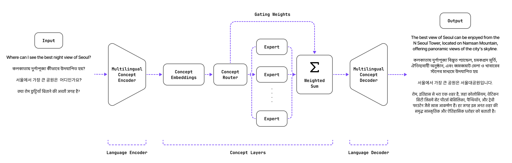

# SUTRA Whitepaper
This repository contains the complete LaTeX files, bibliography, figures, and necessary scripts to compile the paper. SUTRA introduces a novel dual-transformer approach that decouples concept learning and language learning.


## Repository Structure

- `README.md` - This file
- `SUTRA-Whitepaper.pdf` - PDF of pre-compiled whitepaper
- `arxiv.sty` - ArXiv style file for formatting
- `images/` - Directory containing figures and diagrams
- `main.tex` - Main LaTeX source file
- `references.bib` - Bibliography file with references

## How to Compile

To generate the PDF from the LaTeX source, follow these steps:

### Using `pdflatex` and `bibtex`
```sh
pdflatex main.tex
bibtex main
pdflatex main.tex
pdflatex main.tex
```

## Table of Contents
- [Introduction](#Introduction)
- [SUTRA's Dual Transformer Architecture](#sutra-models-comes-in-multiple-flavors)
- [Multilingual Performance on MMLU Benchmark](#repository-structure)

### Introduction

In this paper, we introduce SUTRA, multilingual Large Language Model architecture capable
of understanding, reasoning, and generating text in over 50 languages. SUTRA’s design uniquely
decouples core conceptual understanding from language-specific processing, which facilitates scalable
and efficient multilingual alignment and learning. Employing a Mixture of Experts framework
both in language and concept processing, SUTRA demonstrates both computational efficiency and
responsiveness. Through extensive evaluations, SUTRA is demonstrated to surpass existing models
like GPT-3.5, Llama2 by 20-30% on leading Massive Multitask Language Understanding (MMLU)
benchmarks for multilingual tasks. SUTRA models are also online LLMs that can use knowledge
from the internet to provide hallucination-free, factual and up-to-date responses while retaining their
multilingual capabilities. Furthermore, we explore the broader implications of its architecture for the
future of multilingual AI, highlighting its potential to democratize access to AI technology globally
and to improve the equity and utility of AI in regions with predominantly non-English languages.
Our findings suggest that SUTRA not only fills pivotal gaps in multilingual model capabilities but
also establishes a new benchmark for operational efficiency and scalability in AI applications.


### SUTRA's Dual Transformer Architecture

SUTRA is a novel multilingual large language model architecture that is trained by decoupling concept
learning from language learning. The input is processed through a multilingual concept encoder,followed by the
concept model and finally through a multilingual concept decoder to generate the output response.



### Multilingual Performance on MMLU Benchmark

We evaluate our model on a variety of NLU and NLG tasks. To test the knowledge and reasoning capabilities of the model, we evaluate on the machine-translated version of the benchmarks such as MMLU [Hendrycks et al., 2021]. The Massive Multitask Language Understanding (MMLU) benchmark is a comprehensive and challenging evaluation framework designed to test the capabilities of Large Language Models (LLMs) across a wide array of tasks. It was created with the goal of pushing the boundaries of what LLMs can understand and how well they can adapt to various domains of knowledge. The benchmark covers 57 subjects across STEM, the humanities, the social sciences, and more. It ranges in difficulty from an elementary level to an advanced professional level, and it tests both world knowledge and problem solving ability. Subjects range from traditional areas, such as mathematics and history, to more specialized areas like law and ethics. The granularity and breadth of the subjects makes the benchmark ideal for identifying a model’s blind spots. This diversity ensures that models are not only proficient in a broad spectrum of topics but also capable of generalizing their understanding to new and unseen domains. The MMLU evaluates models on their ability to answer multiple-choice questions, requiring nuanced comprehension and the application of reasoning, which collectively serve as a measure of an LLM’s depth of knowledge and its interpretive skills.

To assess our models’ effectiveness in various tasks and across multiple languages, we developed a multilingual evaluation suite that broadens the scope of evaluation linguistically. We utilized the multilingual assessment framework suggested by Lai et al. [2023] and Üstün et al. [2024], with certain distinctions. Notably, while Okapi uses a 25-shot evaluation, our methodology employs a 5-shot evaluation as per the original benchmark by Hendrycks et al. [2021]. We anticipate that a 5-shot evaluation, offering fewer examples, presents a more challenging benchmark. Recognizing the existence of over 200 major languages globally, our evaluation focuses on three distinct language groups: English, Korean, Japanese, Arabic, and Indian Languages. Although this selection is not exhaustive, it encompasses a significant portion of linguistic diversity, enabling thorough analysis of the models’ multilingual capabilities. These languages represent a substantial demographic, accounting for more than half of the global population as primary or secondary speakers. Additionally, they are key languages in global business, ensuring our evaluation has broad relevance. 

The table below shows the multilingual performance of various leading models on the MMLU benchmark across multiple languages. SUTRA demonstrates competitive performance in English while maintaining strong multilingual capabilities. Many leading models' MMLU scores for non-English languages approach random chance (25% is random chance on the MMLU task).

| **Language**  | **SUTRA** | **LL3 70B** | **LL2 70B** | **GPT 4** | **GPT 3.5** | **Mixt. 8x22B** | **Mixt. 8x7B** | **HCX** | **PPLX** |
|--------------|----------|------------|------------|----------|------------|----------------|----------------|--------|--------|
| English      | 77       | 82         | 63         | 86       | 70         | 77             | 70             | 66     | 62     |
| Hindi        | 68       | 64         | 31         | 71       | 39         | 38             | 35             | 39     | 32     |
| Korean       | 67       | 60         | 38         | 72       | 51         | 56             | 46             | 54     | 40     |
| Gujarati     | 67       | 54         | 29         | 61       | 35         | 29             | 29             | 36     | 26     |
| Tamil        | 67       | 52         | 29         | 44       | 30         | 34             | 29             | 33     | 27     |
| Bengali      | 68       | 58         | 27         | 73       | 36         | 37             | 33             | --     | --     |
| Punjabi      | 67       | 55         | 26         | 71       | 34         | 29             | 30             | --     | --     |
| Marathi      | 69       | 62         | 25         | 66       | 32         | 36             | 32             | --     | --     |
| Telugu       | 68       | 53         | 24         | 62       | 32         | 32             | 28             | --     | --     |
| Arabic       | 67       | 60         | 48         | 80       | 49         | 48             | 39             | --     | --     |
| Japanese     | 75       | 70         | 56         | 80       | 57         | 60             | 51             | --     | --     |

